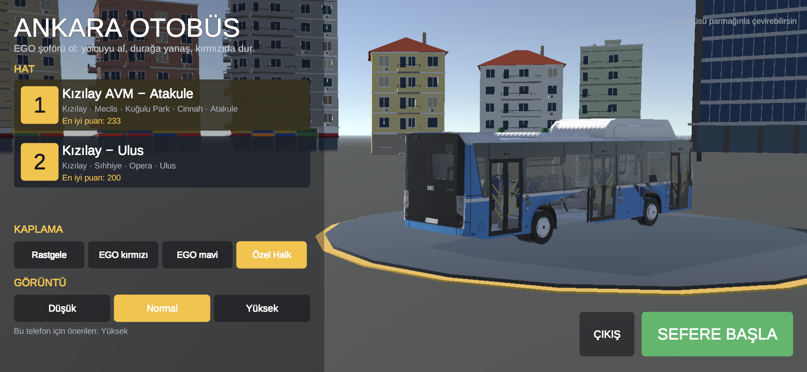

# Ana Menü

Ana menü sahnesi `Scenes/AnaMenu.unity`'dir ve **Ankara Bus → Ana Menü Sahnesini Kur** ile kurulur (`Editor/AnaMenuKurucu.cs`). Kurucu Build Settings sırasını ana menü, `OyunSecimi.Hatlar` sırasıyla hat sahneleri, en sonda diğerleri (TestTrack) olarak yazar; oyun ana menüyle açılır.

## Ekran

Sol yarıda menü:
- **HAT:** Her hat için bir kart: hat numarası, adı, durakları ve en iyi puanı ("Henüz oynanmadı" ya da "En iyi puan: 437"). Sahnesi build'de olmayan hat seçilemez.
- **KAPLAMA:** Rastgele, EGO kırmızı, EGO mavi, Özel Halk. Seçince sağdaki otobüs hemen o kaplamaya geçer.
- **GÖRÜNTÜ:** Düşük / Normal / Yüksek (`GrafikAyarlari`). Altında telefon için önerilen seviye yazar. Yüksek seçilince vitrindeki otobüs de tam kalite modele geçer.
- **SEFERE BAŞLA** (sağ alt): Seçili hattı bir yükleniyor ekranıyla açar. **ÇIKIŞ** ve Android geri tuşu oyunu kapatır.

Sağ yarıda döner podyumda otobüs (`UI/MenuVitrini.cs`) durur:
- Kendiliğinden yavaşça döner, parmakla ya da fareyle çevrilebilir.
- Kamera ekran oranına göre yerleşir, otobüsü ekranın sağ yarısında tutar.
- Arkada Atakule ve yarım halka apartmanlar (hat kitlerinden) vardır.

Vitrindeki otobüs, prefabın görsel kopyasıdır: fizik, ses, puan ve girdi bileşenleri kurulumda çıkarılır. Yalnızca `BusLivery` ve `BusKaliteModeli` kalır.

## Seçimler

Seçimler `Gameplay/OyunSecimi.cs` üzerinden PlayerPrefs'te saklanır:

| Anahtar | Değer |
|---|---|
| `SeciliHat` | `OyunSecimi.Hatlar` sırası |
| `Kaplama` | −1 rastgele, 0.. kaplama sırası (kayıt yoksa prefabın kendi kaplaması) |
| `EnIyiPuan_<hat no>` | Hattın en iyi puanı, `SeferPuanlama` yazar |

Hat sahnesindeki otobüs kaplamayı kendisi uygular (`BusLivery.useMenuChoice`). Bir hat sahnesi Editor'de doğrudan açılıp oynanırsa da son menü seçimi geçerli olur.

Yeni bir hat eklemek için `OyunSecimi.Hatlar`'a satır eklemek ve sahnesini Build Settings'e koymak yeterli.

## Oyundan menüye dönüş

- **Hat sonu özeti** (`PuanGostergesi`): TEKRAR / MENÜ / KAPAT.
- **AYARLAR paneli** (`BusTouchControls`): ANA MENÜ / KAPAT.

Menü sahnesi build'de değilse MENÜ düğmeleri görünmez (örneğin ölçüm APK'larında).

## Build

**Ankara Bus → Android → Oyun APK'sı** ana menü + Hat 1 + Hat 2 ile `Builds/AnkaraBus.apk` üretir (normal build; ölçüm ve test build'leri Development). Ölçüm ve otomatik pilot eklenmez.

## Test

**Ankara Bus → Menü ve Kamera Testi** (Editor) ya da **Ankara Bus → Android → Menü ve Kamera Testi APK'sı** (telefon, `adb logcat -s Unity | grep MenuTest`). `MenuKameraTesti` menüden başlar, sanal dokunmatik ekranla gerçek parmak hareketleri gönderir: vitrin yerleşimi (16:9, 20:9), dönme ve parmakla çevirme, kaplama ve kalite düğmeleri, bina cepheleri, en iyi puan, SEFERE BAŞLA + kaplama, KAMERA sırası, 360° sürükleme, giderken arkaya dönüş, direksiyon + kamera iki parmak, pinch, çift dokunuş, kokpit, fare, AYARLAR → ANA MENÜ, hat sonu MENÜ. Dokunmatik kısımlar Editor'ün batch modunda çalışmaz; telefonda çalıştırılmalı.
