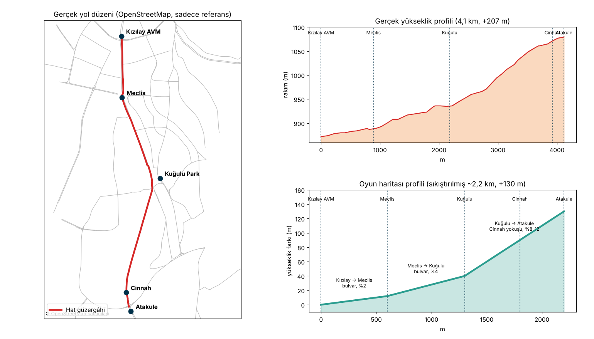

# Harita Tasarımı — Hat 1: Kızılay AVM → Atakule

**İlke:** OpenStreetMap yalnızca **ilham** için kullanılır. Gerçek haritayı kopyalamıyoruz. Gerçekteki yol karakterini (düz bulvar, ardından kıvrımlı dik yokuş) ve simge yapıları alıp **kısaltılmış, stilize** bir harita kuruyoruz.

## Gerçek güzergâh (referans)

| | |
|---|---|
| Uzunluk | ~4,1 km |
| Rakım | 872 m (Kızılay) → 1079 m (Atakule), **+207 m** |
| Yol | Atatürk Bulvarı (Kızılay → Kuğulu Park), ardından Cinnah Caddesi (Kuğulu → Atakule) |
| Eğim | Bulvar boyunca %2–5; Cinnah Caddesi'nde %7–13, kısa yerlerde %15'e kadar |

## Oyun haritası (MVP)

Toplam **~2,2 km**, **+130 m**. Unity'de 1 birim = 1 metre. Başlangıç noktası (0,0,0) Kızılay AVM durağı, güzergâh +Z yönünde ilerler.

| Bölüm | Uzunluk | Eğim | Yol | Karakter |
|---|---|---|---|---|
| **A** Kızılay → Meclis | 600 m | %2 | 2×3 şerit, ortada ağaçlı refüj, ~30 m genişlik | Kalabalık, dükkânlı apartmanlar, Güvenpark yeşili |
| **B** Meclis → Kuğulu | 700 m | %4 | 2×3 şerit bulvar | Meclis duvarı ve ağaçlar bir yanda, apartmanlar ve elçilik bahçeleri diğer yanda |
| **C** Kuğulu → Atakule | 900 m | %8–12 | 2×2 şerit, ~18 m, 2–3 kıvrım | Dik yokuş, yamaca basamaklanmış apartmanlar, Botanik Parkı yeşili |
| **Dönüş** | — | düz | Atakule önünde dönüş halkası | Otobüs burada dönüp hattı tersine sürebilir |

Kuğulu Park kavşağında **sağa dönüşle** Cinnah'a girilir; bu oyundaki tek büyük kavşak.

### Duraklar

| # | Durak | Konum (yol üzerinde) | Not |
|---|---|---|---|
| 1 | Kızılay AVM | 0 m | Başlangıç. Cam cepheli AVM bloğu, Güvenpark karşıda |
| 2 | Meclis | 600 m | TBMM duvarı, kapısı ve ağaçlar |
| 3 | Kuğulu Park | 1300 m | Göl ve kuğular, söğütler; kavşaktan hemen önce |
| 4 | Cinnah | 1800 m | Yokuşun ortası. **Yokuşta kalkış** testi burada |
| 5 | Atakule | 2200 m | Son durak. Atakule kulesi (kule + üstte küre) |

### Simge yapılar (low-poly, stilize)

- **Kızılay AVM**: cam cepheli, 4–5 katlı blok
- **Güvenpark**: ağaçlar, çim, yürüyüş yolları (yalnızca kenar dekor)
- **TBMM**: uzun taş duvar, büyük kapı, arkada ağaçlar; ana bina uzakta silüet
- **Kuğulu Park**: küçük gölet, kuğu modelleri, söğüt ağaçları
- **Atakule**: 125 m'lik kule, üstte küre. Yolun her yerinden görünmeli, haritanın "pusulası"

### Binalar: modüler Ankara apartman seti

| Tip | Kat | Özellik | Nerede |
|---|---|---|---|
| A1 Bulvar apartmanı | 6–8 | Zemin katta dükkân ve tente, düz cephe, uzun balkon şeritleri | Bölüm A |
| A2 Köşe apartmanı | 6–7 | Pahlı/yuvarlak köşe, iki cephe dükkân | Kavşaklar |
| A3 70'ler Çankaya apartmanı | 4–5 | Bahçe duvarı, girişte taş kaplama, kırma kiremit çatı | Bölüm B |
| A4 Yamaç apartmanı | 3–6 | Yokuşa basamaklanan zemin, yokuş aşağı tarafta ek kat | Bölüm C |
| A5 Ofis/Cam bina | 8–12 | Cam cephe | Kuğulu çevresi |

Her tipte renk (krem, bej, somon, açık sarı, gri) ve kat sayısı varyasyonu. Ortak detaylar: PVC pencereler, demir balkon korkulukları, klima dış üniteleri, çanak antenler, su depoları.

**Mobil bütçe:** bina başına 1 materyal + ortak doku atlası, LOD0/LOD1, görünür alanda < 300k üçgen, < 150 draw call.

### Trafik (MVP sonrası, Faz 5)

| Araç | Oran |
|---|---|
| Hyundai Accent Blue — sarı taksi | ~%30 |
| Klasik Türkiye arabaları: Tofaş Şahin/Doğan/Kartal, Renault 12 Toros, Murat 131, Renault Broadway, Fiat Albea/Linea | ~%60 |
| Dolmuş (Ford Transit tarzı minibüs) | ~%10 |

Araç modelleri lisanslı marka kullanımı gerektirdiğinden yalnızca **kişisel prototip** içindir.

## Harita parçalara bölünür

`Map_A_Kizilay`, `Map_B_Bulvar`, `Map_C_Cinnah` ayrı prefab/sahneler olur. Böylece:
- İki kişi aynı anda farklı parçalarda çalışabilir.
- Mobilde parçalar sırayla yüklenip boşaltılabilir.
