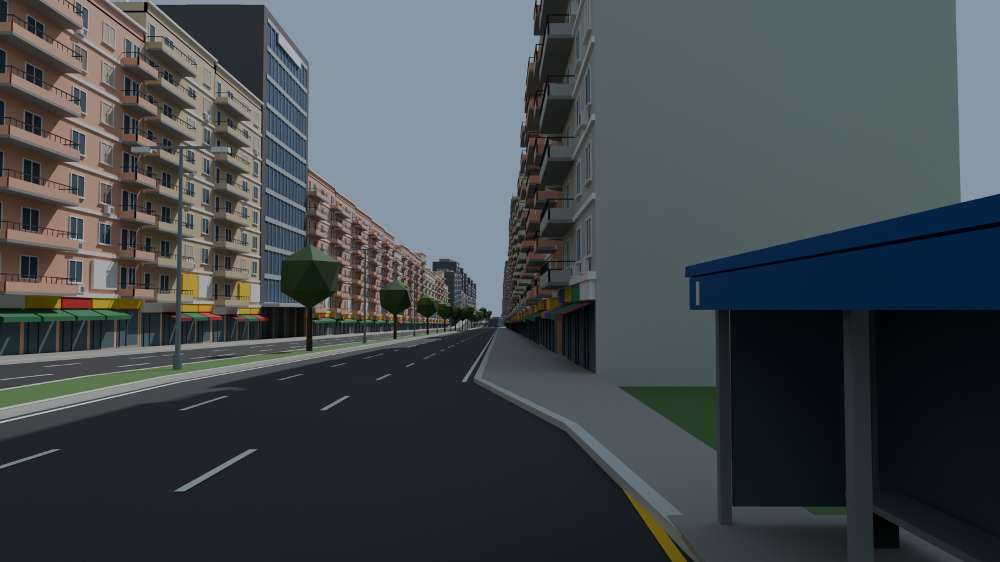
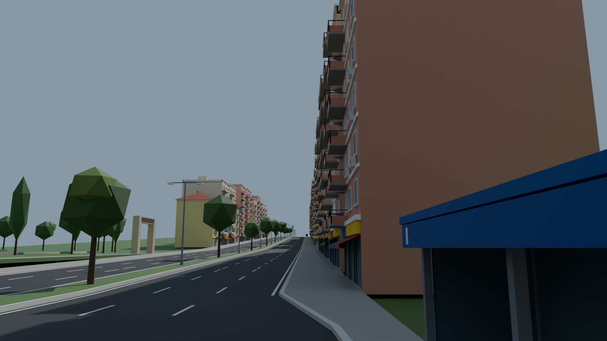
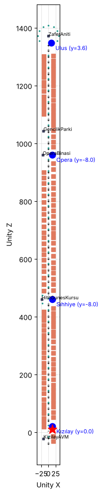
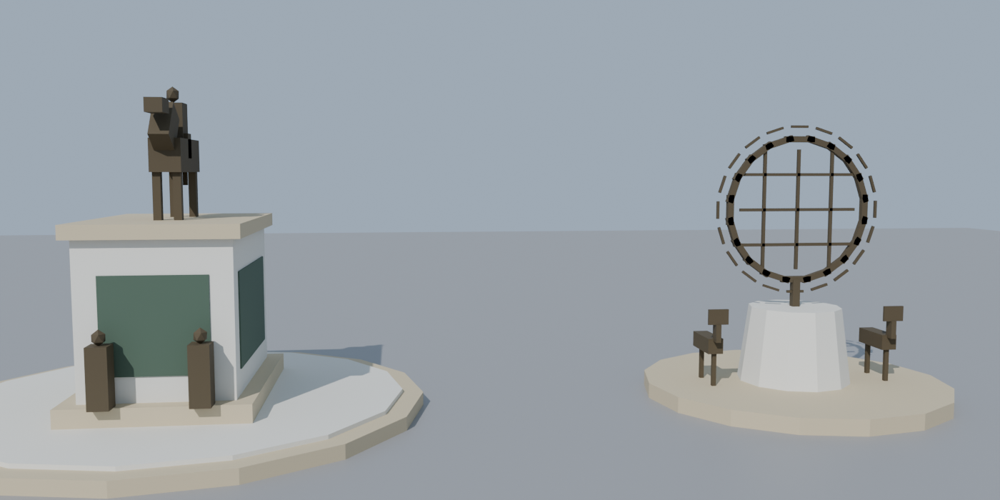

# Hat 2 — Kızılay → Sıhhiye → Opera → Ulus

| Sürücü gözü (Kızılay) | Opera → Ulus | Plan |
|---|---|---|
|  |  |  |

## Gerçek güzergâh (referans, OpenStreetMap + SRTM)

Atatürk Bulvarı boyunca neredeyse dümdüz kuzeye, ~2 km. Kızılay 868 m → Sıhhiye 855 m (çukur; demiryolu köprüsü kısa bir tümsek yapar) → Opera ~860 m → Ulus 877 m. Gerçek haritayı kopyalamıyoruz; Hat 1'deki gibi stilize.

## Oyun haritası

`tools/blender/harita_hat2.py` → `Maps/Hat2/Hat2_Yerlesim.json` + `Zemin_Hat2.fbx`. Toplam **1,35 km**.

| Bölüm | Uzunluk | Eğim | Karakter |
|---|---|---|---|
| Kızılay → Sıhhiye | 400 m | −%2 | Dükkânlı bulvar apartmanları |
| Sıhhiye köprüsü | 160 m | +%4 / −%4 | Kısa tümsek; çevrede ofis/bakanlık binaları |
| Sıhhiye → Opera | 300 m | düz | Ofisler |
| Opera → Ulus | 360 m | +%2…%4 | Solda Opera binası ve Gençlik Parkı, eski kırma çatılı binalar |
| Ulus | — | düz | Zafer Anıtı çevresinde dönüş halkası |

| # | Durak | Yükseklik | Simge |
|---|---|---|---|
| 1 | Kızılay | 0 m | Kızılay AVM (geride, solda) |
| 2 | Sıhhiye | −8 m | Hitit Güneş Kursu anıtı (solda küçük meydan) |
| 3 | Opera | −8 m | Opera binası, ardından Gençlik Parkı |
| 4 | Ulus | +3,6 m | Zafer Anıtı (halkanın adasında) |

Yaklaşık 130 bina, 45 ağaç, 67 yol parçası, iki yönde 3'er trafik şeridi. Kavşak ve ışık yok.

### Yeni modeller

| Model | Not |
|---|---|
| `Landmarks/ZaferAniti` | Basamaklı kaide, bronz kabartmalar, köşelerde asker figürleri, atlı heykel (stilize), ~12 m |
| `Landmarks/OperaBinasi` | 1930'lar kesme taş kütle, dikey pencere şeritleri, sütunlu giriş, sahne kulesi; 64 × 26 m |
| `Landmarks/GenclikParki` | Büyük süs havuzu, adacık, ağaçlar, kemerli giriş; 90 × 60 m |
| `Landmarks/HititGunesKursu` | Sıhhiye anıtı: ışınlı halka disk ve geyik figürleri |
| `Roads/Bulvar_Inis2_20m`, `Bulvar_Inis4_20m` | Bulvar inişleri |
| `Roads/Ulus_DonusHalkasi` | Bulvar genişliğinde dönüş halkası (ada yarıçapı 14 m) |

## Unity'de kurulum

1. Yeni sahne: `Assets/_Project/Scenes/Hat2_KizilayUlus.unity`.
2. **Ankara Bus → Hat 2 Haritasını Kur.** Harita, duraklar, `Hat_2` rotası, trafik, yolcular ve `OtobusBaslangic` noktası kurulur.
3. Otobüs prefabını `OtobusBaslangic`'a koy. `RouteTracker` → Route = `Hat_2`. Hat 1'deki gibi ışık ve occlusion bake'i yap; sahneyi Build Settings'e ekle.

Hat 1 ve Hat 2 ayrı sahneler, ikisi de kendi başlangıç noktasına göre (0, 0, 0) kurulur.
