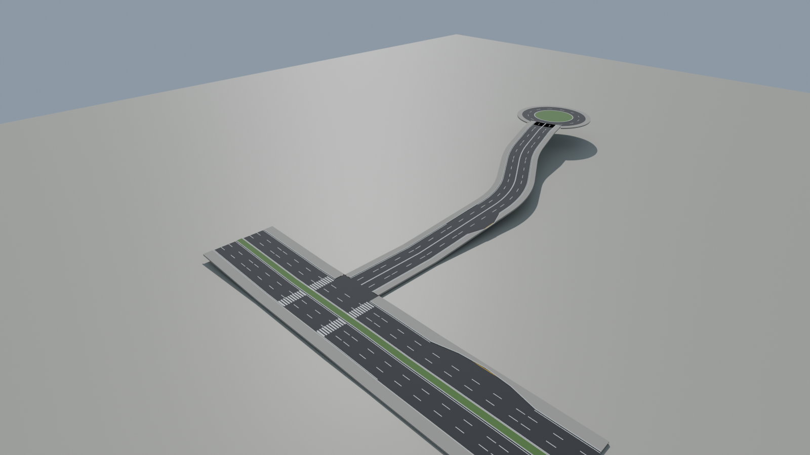
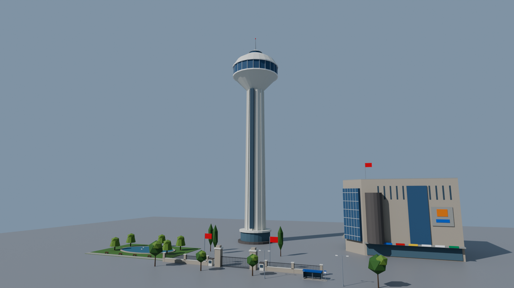
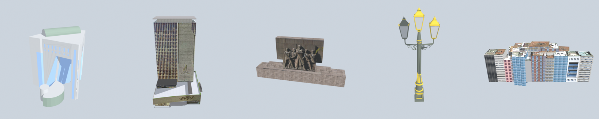

# Model Kitleri: Binalar, Yollar, Simge Yapılar



Tüm modeller `tools/blender/` altındaki scriptlerle **üretilir**. Elle düzenlemek yerine scripti değiştirip yeniden üretmek tercih edilir; böylece her şey tutarlı kalır.

```bash
pip install bpy matplotlib           # Python 3.13 için bpy 5.x
python tools/blender/apartman_kit.py --out <klasör> [--render onizleme.png] [--only A1_Bulvar_6Kat_Krem ...]
python tools/blender/yol_kit.py      --out <klasör> [--render onizleme.png]
python tools/blender/yapilar_kit.py  --out AnkaraBusSimulator/Assets/_Project/Maps [--render onizleme.png]
```

## Ortak palet materyali

Bina ve yolların hepsi **tek bir doku** kullanır: `Assets/_Project/Materials/T_AnkaraPalet.png` (16×16 renk karesi, 256 piksel). Her yüzün UV'si bir renk karesinin ortasına bakar. Sonuç olarak:
- Bütün bina ve yollar **tek materyali** paylaşır. Mobilde static batching ile çok az draw call olur.
- Renk değiştirmek için palet dokusunu düzenlemek yeterlidir.

**Unity'de kurulum:**
1. `T_AnkaraPalet.png` → Inspector: **Filter Mode: Point**, **Generate Mip Maps: kapalı**, Compression: None ya da ASTC 4x4.
2. `Materials/M_AnkaraPalet` adında URP/Lit (veya mobil için URP/Simple Lit) materyal oluştur, Base Map = `T_AnkaraPalet`, Smoothness ~0.1.
3. FBX'lerin Import Settings → Materials sekmesinde **Material Creation Mode: None** yap ve prefablarda `M_AnkaraPalet`'i ata. Ya da Remapped Materials ile `M_AnkaraPalet` materyaline bağla.
4. Model sekmesinde **Generate Lightmap UVs** açık olsun (ışık bake için gerekli).

Palete yeni renk eklenecekse `apartman_kit.py` içindeki `PALETTE` sözlüğünün **sonuna** eklenmeli. Araya eklenirse eski FBX'lerin renkleri kayar.

## Eksen ve pivot kuralları (Unity)

> **Unity'de doğrulandı (8 Ekim 2026, Hat 1 sahnesi):** Bulvar binalarında dükkân, tente ve balkonlu ön cephe yola, sade arka cephe dışa bakıyor; Cinnah'ın iki yanındaki binalar da yola dönük. Bulvar parçaları, T kavşağı (Cinnah ağzı) ve Cinnah virajları boşluksuz birleşiyor. Aşağıdaki kurallar doğru, düzeltme gerekmedi.

| | Pivot | Yön |
|---|---|---|
| Binalar | Ön cephe çizgisinin ortası, zemin seviyesi (0) | Ön cephe **+Z**'ye bakar. Yolun kenarına dizerken binayı ön cephesi yola bakacak şekilde döndürün. |
| A4 yamaç binaları | Aynı | Zeminin altına 3 m inen taş kaide var; yokuşta binayı kaideye gömerek yerleştirin. |
| Yollar | Başlangıç kenarının ortası, yol yüzeyi (0) | Yol **+Z** yönünde ilerler, sağ taraf **+X**. |

## Bina listesi

| Model | Tip | Boyut (G × D × Y, m) | Üçgen |
|---|---|---|---|
| `A1_Bulvar_6Kat_Krem` | Bulvar apartmanı, dükkânlı | 14.6 × 15.3 × 25.0 | 4236 |
| `A1_Bulvar_7Kat_Somon` | Bulvar apartmanı, dükkânlı | 18.2 × 15.3 × 28.0 | 7248 |
| `A1_Bulvar_8Kat_Bej` | Bulvar apartmanı, dükkânlı | 14.6 × 15.3 × 31.0 | 5544 |
| `A2_Kose_7Kat_Gri` | Köşe apartmanı (köşe sol önde) | 18.8 × 15.2 × 28.0 | 10880 |
| `A2_Kose_6Kat_Somon` | Köşe apartmanı (köşe sol önde) | 15.2 × 15.2 × 25.0 | 8708 |
| `A3_Cankaya_5Kat_SariKirma` | 70'ler Çankaya, kırma çatı | 11.8 × 14.1 × 19.1 | 2370 |
| `A4_Yamac_5Kat_Yesil` | Yamaç, taş kaide, bahçe | 11.0 × 15.4 × 24.0 | 3408 |
| `A4_Yamac_4Kat_BeyazKirma` | Yamaç, taş kaide, bahçe, kırma çatı | 15.4 × 15.8 × 22.5 | 3056 |
| `A5_Ofis_10Kat_Mavi` | Cam ofis | 21.6 × 18.5 × 44.5 | 468 |
| `A5_Ofis_8Kat_Yesil` | Cam ofis | 18.6 × 18.5 × 37.3 | 408 |

## Yol parçaları

Kesitler:
- **Bulvar** (Atatürk Bulvarı): 2×3 şerit × 3,5 m, ortada 3 m çimli refüj, iki yanda 4,5 m kaldırım. Toplam genişlik 33 m.
- **Cinnah**: 2×2 şerit × 3,25 m, ortada çift düz çizgi, iki yanda 3 m kaldırım. Toplam genişlik 19 m.
- Bordür yüksekliği 15 cm.

Bir parçanın **bitiş konumu ve yönü**, sonraki parçanın başlangıcıdır. Parçaları uç uca eklerken sonrakini bu konuma koyup Y ekseninde bu açı kadar döndürün.

| Parça | Bitiş konumu (x, y, z) | Bitiş yönü (Y ekseni) | Üçgen |
|---|---|---|---|
| `Bulvar_Duz_20m` | (+0.00, +0.00, +20.00) | +0.0° | 96 |
| `Bulvar_Egim2_20m` | (+0.00, +0.40, +20.00) | +0.0° | 384 |
| `Bulvar_Egim4_20m` | (+0.00, +0.80, +20.00) | +0.0° | 384 |
| `Bulvar_DurakCebi_40m` | (+0.00, +0.00, +40.00) | +0.0° | 172 |
| `Bulvar_DurakCebi_Egim4_40m` | (+0.00, +1.60, +40.00) | +0.0° | 872 |
| `Kavsak_Bulvar_Cinnah_T` | (+0.00, +0.00, +40.00) | +0.0° | 320 |
| `Cinnah_Duz_20m` | (+0.00, +0.00, +20.00) | +0.0° | 64 |
| `Cinnah_Egim8_20m` | (+0.00, +1.60, +20.00) | +0.0° | 272 |
| `Cinnah_Egim10_20m` | (+0.00, +2.00, +20.00) | +0.0° | 272 |
| `Cinnah_Egim12_20m` | (+0.00, +2.40, +20.00) | +0.0° | 272 |
| `Cinnah_Viraj_Sag15_Egim10` | (+2.60, +2.00, +19.77) | +15.0° | 272 |
| `Cinnah_Viraj_Sol15_Egim10` | (-2.60, +2.00, +19.77) | -15.0° | 272 |
| `Cinnah_Viraj_Sag30_Egim8` | (+7.68, +2.40, +28.65) | +30.0° | 406 |
| `Cinnah_Viraj_Sol30_Egim8` | (-7.68, +2.40, +28.65) | -30.0° | 406 |
| `Cinnah_DurakCebi_Egim8_30m` | (+0.00, +2.40, +30.00) | +0.0° | 488 |
| `Atakule_DonusHalkasi` | (+0.00, +0.00, +14.00) | +0.0° | 968 |

Notlar:
- `Kavsak_Bulvar_Cinnah_T`: Yan yolun (Cinnah) ağzı parçanın ortasında (Z = 20), sağ tarafta. Yan yol koluna 12 m'lik başlangıç dahil; Cinnah parçaları **(X = +28.5, Z = +20)** noktasından, Y ekseninde **+90°** dönmüş olarak başlar.
- `Atakule_DonusHalkasi`: 14 m giriş yolu + halka (ada yarıçapı 12 m). Atakule adanın merkezine oturur: **(0, 0, +29.75)**. Tablodaki bitiş, giriş yolunun ucudur.
- Durak cepleri sağ kaldırımda, 3 m derinliğinde, uçları 8 m'lik geçişle. `BusStop` objesini cebin ortasına koyun.
- Fizik: Yol FBX'lerine **Mesh Collider** ekleyin. Kaldırım bordürleri de collider'da olduğu için otobüs bordüre çarpar.
- Yollar araziyle birleşmez; yol kenarlarında 0,6 m aşağı inen etek var. Arazi (Terrain) bu eteğin biraz altında kalacak şekilde düzenlenmeli.

## Simge yapılar ve sokak objeleri



| Model | Boyut (G × D × Y, m) | Üçgen | Not |
|---|---|---|---|
| `Landmarks/Atakule` | 28.4 × 28.4 × 125.2 | 1540 | Dönüş halkası adasının merkezine: `Atakule_DonusHalkasi` başlangıcından (0, 0, +29.75) |
| `Landmarks/KizilayAVM` | 49.8 × 41.6 × 42.0 | 640 | Cam köşe sol önde; bulvar köşesine bakmalı |
| `Landmarks/TBMM_Duvar_20m` | 21.1 × 1.1 × 3.6 | 1068 | X ekseni boyunca uzanır, uç uca eklenir |
| `Landmarks/TBMM_Kapi` | 30.2 × 2.4 × 12.0 | 736 | Kapı + nöbet kulübeleri + bayraklar |
| `Landmarks/KuguluPark_Golet` | 44.0 × 30.0 × 7.5 | 992 | Gölet, kuğular, söğütler, banklar |
| `Props/EGO_Durak` | 7.9 × 2.5 × 3.2 | 224 | Durak ceplerinin kaldırımına |
| `Props/Lamba_Bulvar` | 3.9 × 0.4 × 9.0 | 104 | Refüje, çift kollu |
| `Props/Agac_Cinar_1`, `_2` | ~5 × 5 × 7–10 | 60 | Refüj ve kaldırım ağacı |
| `Props/Agac_Kavak` | 2.5 × 2.4 × 13.2 | 40 | Uzun ince kavak |

Ağaç ve lambalar çok tekrarlanacağı için Unity'de **GPU Instancing** açık bir materyal kopyası (`M_AnkaraPalet_Instanced`) ile kullanılabilir.


## SketchUp modelleri (Maps/SKP)



3D Warehouse'tan gelen gerçek Kızılay modelleri. Elle değil, iki scriptle dönüştürülür; kaynak `.skp` dosyaları repoda değil.

```bash
python3 -m venv .venv-skp && .venv-skp/bin/pip install openskp pillow     # bir kere
.venv-skp/bin/python tools/skp/skp_to_glb.py --out <glb> --as kizi.skp=kizi --as gokdelen.skp=gokdelen \
    --as "Güven+Park+...skp=guvenpark" --as Street+lamp.skp=lamba --as Adsız.skp=adsiz <skp dosyaları>
Blender -b --factory-startup -P tools/blender/skp_donustur.py -- --glb <glb> --maps AnkaraBusSimulator/Assets/_Project/Maps
```

- **`skp_to_glb.py`** SketchUp ya da SDK olmadan okur (`openskp`, SketchUp 2021+ dahil). openskp yalnızca PNG/JPEG dokuları taşıyor; SketchUp'a sürüklenmiş **.psd/.bmp/.tif** fotoğrafları (Emek İşhanı'nın cephe ve tabela fotoğrafları bunlar) PNG'ye çevrilir.
- **`skp_donustur.py`** Google Earth zemin fotoğraflarını ve 2D insan figürlerini atar; geometri ve dokular olduğu gibi kalır (sadeleştirme yok). SketchUp'ın iki taraflı yüzleri Unity'de görünsün diye tek taraflı yüzler ters kopyalanır; duvarın üstüne yapıştırılmış fotoğraf düzlemleri (SketchUp "Image") duvarı örter, çakışan kalırsa 1–2 cm öne alınır. Aynı görünen malzemeler birleştirilir. Ön cephe +Z, pivot ön cephe ortası (bina kuralı).
- Dokular `Maps/SKP/**/Textures/` altında; FBX'ler bunlara bağlı. Unity URP Lit malzemelerini FBX'ten kendisi kurar. `HaritaKurucu`, `SKP/` ile başlayan modellere palet malzemesini **basmaz**.

| Model | Boyut (G × D × Y, m) | Üçgen | Malzeme | Nerede |
|---|---|---|---|---|
| `SKP/Landmarks/KizilayAVM` | 72.9 × 86.4 × 76.8 | 12 378 | 7 | Hat 1 sağ / Hat 2 sol, Kızılay durağının gerisi (eski `Landmarks/KizilayAVM` yerine) |
| `SKP/Landmarks/EmekIshani` | 54.7 × 50.7 × 81.4 | 31 154 | 34 | Hat 1 sol, AVM'nin karşısı; Hat 2 sağ, Kızılay durağından sonra |
| `SKP/Landmarks/GuvenlikAniti` | 16.2 × 5.8 × 7.8 | 184 | 4 | Hat 1 sağ, Kızılay durağından sonra Güvenpark (ağaçlı, binasız 72 m) |
| `SKP/Props/Lamba_Nostaljik` | 1.7 × 0.5 × 4.7 | 42 478 / 3 999 / 2 392 (LOD0/1/2) | 7 | Refüj lambaları, iki hatta da (eski `Props/Lamba_Bulvar` yerine) |
| `SKP/Buildings/KizilayBloklari/Blok_01..33` | 13–132 m, 25–37 m yüksek | toplam 2 850 | bina başına 1–4 | Kızılay–Meclis ve Kızılay–Sıhhiye arası **ikinci sıra** (≤ 50 × 40 m olanlar) |

- Lamba 1,4 kat büyütüldü (kaynak 3,3 m). Unity `_LOD0/1/2` adlarından LODGroup kurar. Gece parlaması ve bake ışıkları üç fenere göre: `ZamanAyarlari.LambaBaslari`, `LambaParlamaBoyu`.
- Kızılay blokları Google Earth binaları: ayrık parçalar binalara ayrılır, taban dikdörtgeni eksene hizalanır, ölçüler `Bloklar.json`'da. Binalar zeminin ~10 m altına uzanır (eğimde boşluk kalmaz).
- **Lisans:** 3D Warehouse modelleri (General Model License) ve Google Earth kaynaklı fotoğraflar, otobüs ve araç modelleri gibi yalnızca **kişisel prototip** içindir.
