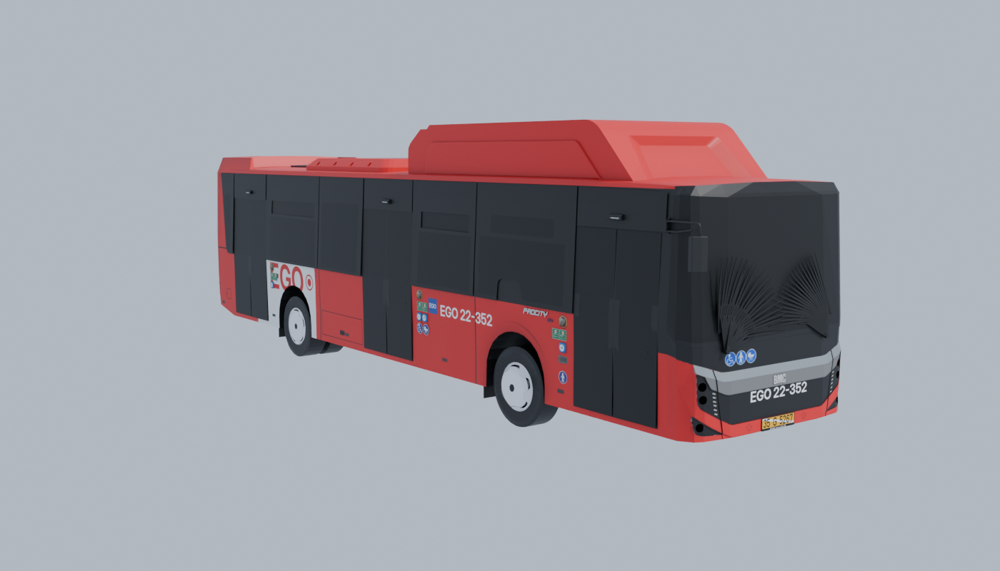

# Otobüs: BMC Procity 12LF



Kaynak: `BMC Procity 12LF/` (Proton Bus Simulator modu, kişisel prototip için). Dönüştürücü: `tools/blender/bmc_donustur.py`.
Çıktı: `AnkaraBusSimulator/Assets/_Project/Buses/BMC_Procity_12LF/BMC_Procity_12LF.fbx` + `Textures/`.

```bash
python tools/blender/bmc_donustur.py --src "BMC Procity 12LF/BMC Procity 12LF" --out <klasör> [--render önizleme.png]
```

> **MAN SL hakkında:** `MAN SL EGO EDIT` klasörü, ayrı bir temel MAN SL eklentisinin üzerine yapılmış bir düzenleme. Model dosyasında 266 parça tanımlı, repoda bunların 43'ü var. Mevcut olanlar yalnızca kokpit, tekerlekler, ön cam ve CNG tankı; **dış gövde yok**. Bu yüzden ilk sürülebilir otobüs BMC Procity oldu. MAN SL için temel eklentinin `SL`, `SL_01`, `SL_02` ve `IBIS` klasörleri bulunursa `tools/blender/o3d_okuyucu.py` ile aynı şekilde dönüştürülebilir.

## Hiyerarşi ve eksenler

Kök obje `BMC_Procity_12LF`: zeminde, otobüsün tam ortasında. **Ön +Z, sağ +X** (kapılar sağda, sürücü solda). Boyut yaklaşık 2,55 × 3,55 × 12 m.

| Parça | Unity yerel konum (x, y, z) | Üçgen | Materyal |
|---|---|---|---|
| `Direksiyon` | (-0.620, +1.441, +5.066) | 4982 | 1 |
| `Govde` | (+0.009, +0.000, -0.215) | 123277 | 34 |
| `Kapi_1_1` | (+0.928, +0.479, +4.953) | 942 | 3 | ±90° (Proton: -90°)
| `Kapi_1_2` | (+0.928, +0.479, +4.312) | 942 | 3 | ±90° (Proton: +90°)
| `Kapi_2_1` | (+0.928, +0.479, +0.398) | 952 | 3 | ±90° (Proton: -90°)
| `Kapi_2_2` | (+0.928, +0.479, -0.215) | 942 | 3 | ±90° (Proton: +90°)
| `Kapi_3_1` | (+0.928, +0.479, -3.999) | 952 | 3 | ±90° (Proton: -90°)
| `Kapi_3_2` | (+0.928, +0.479, -4.614) | 942 | 3 | ±90° (Proton: +90°)
| `Lamba_Fren` | (+0.009, +0.000, -0.215) | 296 | 1 |
| `Lamba_Ic1` | (+0.009, +0.000, -0.215) | 150 | 1 |
| `Lamba_Ic2` | (+0.009, +0.000, -0.215) | 146 | 1 |
| `Lamba_Ic3` | (+0.009, +0.000, -0.215) | 56 | 1 |
| `Lamba_IcSerit` | (+0.009, +0.000, -0.215) | 4 | 1 |
| `Lamba_KisaFar` | (+0.009, +0.000, -0.215) | 432 | 1 |
| `Lamba_Park` | (+0.009, +0.000, -0.215) | 788 | 1 |
| `Lamba_SinyalSag` | (+0.009, +0.000, -0.215) | 585 | 1 |
| `Lamba_SinyalSol` | (+0.009, +0.000, -0.215) | 585 | 1 |
| `Lamba_UzunFar` | (+0.009, +0.000, -0.215) | 432 | 1 |
| `Teker_ArkaSag` | (+0.888, +0.481, -2.720) | 3910 | 2 |
| `Teker_ArkaSol` | (-0.855, +0.477, -2.720) | 3909 | 2 |
| `Teker_OnSag` | (+1.095, +0.477, +2.922) | 6306 | 2 |
| `Teker_OnSol` | (-1.064, +0.477, +2.926) | 6306 | 2 |

- **Tekerlekler** (`Teker_*`): Pivot tekerlek merkezinde, yarıçap ≈ **0,48 m**. Arka tekerlekler çift lastik ve üçgen sayısı azaltıldı.
- **Kapılar** (`Kapi_<kapı>_<kanat>`): 3 kapı × 2 kanat, hepsi sağda. Pivot, Proton'daki dönme noktası (kanadın 0,3 m içeride, dikey eksen). Kanatlar **Y ekseninde 90°** döner: `_1` kanadı ve `_2` kanadı ters yönlere. Proton'da `_1` için −90°, `_2` için +90°; Unity'nin sol el koordinatında işaret ters çıkabilir, sahnede deneyerek doğrulayın.
  `BusDoor` ayarı: Motion = Rotate, Open Euler Offset = (0, ±90, 0), Duration = 1.4.
- **Direksiyon**: Pivot direksiyon merkezinde. Direksiyon eğik olduğu için dönme ekseni objenin kendi yukarı ekseni değil; bir boş obje altına alıp ekseni hizalamak gerekebilir.
- **Lambalar** (`Lamba_*`): Fren, sinyaller, kısa/uzun far, park ve iç aydınlatma, ayrı objeler halinde. Proton'da bunlar ışık yanınca görünen parlak kaplamalar. Unity'de **varsayılan kapalı** olmalı; fren ve sinyal sistemi bunları açıp kapatır.

## Unity kurulumu (Y3 için)

1. **FBX import:** Scale Factor 1, Convert Units açık. Materials sekmesi: Location = **Use External Materials (Legacy)** ya da Extract Materials ile materyalleri `Materials/` klasörüne çıkar.
2. **Saydam materyaller:** Adı `_Cam` ile bitenler (camlar, kapı camları) URP/Lit **Surface Type: Transparent** olmalı. `M_lumini` (lamba camları) da saydam olabilir.
3. **Dokular:** 4096'lık kaplamalar mobil için ağır; **Max Size 2048** (gerekirse 1024), Format ASTC 6x6.
4. **Kaplama:** Varsayılan kaplama **EGO**: kırmızı gövde, siyah cam bandı, arka tekerlek üstünde beyaz "EGO" paneli, filo numarası "EGO 22-352". Bu kaplamayı `tools/kaplama_ego.py` üretir (`--filo` ile filo numarası değiştirilebilir; tavan CNG modülü `cngtank.png` da kırmızı). Gövde boyası `M_caroserie` materyalinde. Diğer kaplamalar `Textures/Kaplamalar/` içinde: `caroserie_beyaz_orijinal.png` (modelin orijinali), `white.png`, `tgm.png`, `r38.png`; bunlar materyalin Base Map'i yapılarak denenebilir.
5. **Sürüş değerleri** (Proton dosyalarından; `BusPhysicsSpec` varsayılanları bunlardan alındı, süspansiyon yayı kütleden hesaplanır):

| Ayar | Değer |
|---|---|
| Kütle | 16000 kg (ini: `mass1`) — dolu otobüs için 18000'e kadar |
| Ağırlık merkezi (yerel) | ≈ (0.01, 0.52, 0.27) — devrilmemesi için biraz daha alçak (y ≈ 0.4) tutulabilir |
| Tekerlek yarıçapı | 0.48 m |
| Süspansiyon mesafesi | 0.25 m, yay 88290, amortisör 8829 |
| Motor | Rölanti 600 rpm, maks. tork 1000 Nm @ 1500 rpm, devir sınırı 2300 rpm |
| Şanzıman (otomatik, 6 ileri) | 3.43 / 2.01 / 1.42 / 1.00 / 0.83 / 0.59, geri −4.84; vites büyütme 2200, küçültme 1200 rpm |
| Diferansiyel oranı | 6.5 |
| Çekiş | Arka (4x2) |
| Direksiyon | Toplam 900° (2,5 tur) |

6. **Çarpışma:** Gövdeye basit bir **Box Collider** (≈ 2.5 × 2.7 × 11.9 m, merkez y ≈ 1.78) yeterli; mesh collider kullanmayın.

## Performans notu

Toplam yaklaşık **158 bin üçgen** (silecek animasyonunun 19 fazla karesi atıldı; önce 196 bindi). Büyük kısmı iç mekânda: koltuklar, tutamaklar, kokpit. Oyuncunun otobüsü için ilk aşamada kabul edilebilir. Telefonda FPS düşerse:
- Dış kamera için iç mekânı sadeleştirilmiş bir LOD,
- Uzak/AI otobüsleri için ~15 bin üçgenlik ayrı bir LOD

`bmc_donustur.py`'ye eklenebilir.
