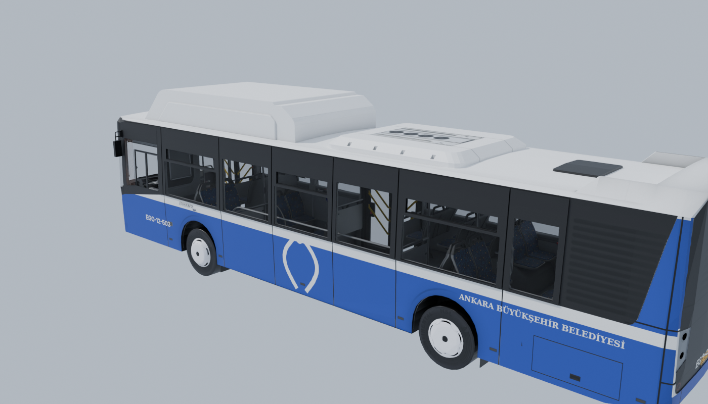
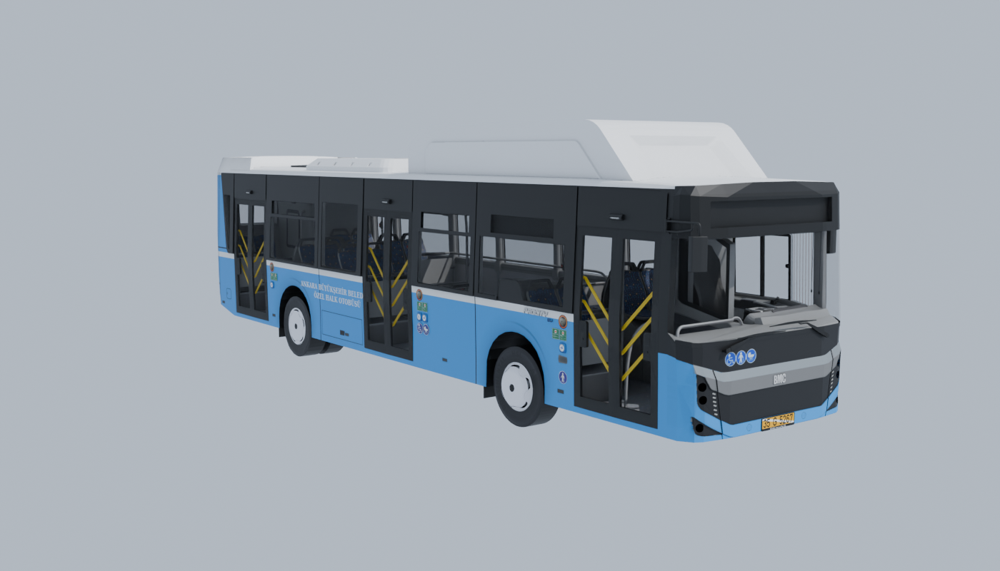

# Otobüs: BMC Procity 12LF


Kaynak: `BMC Procity 12LF/` (Proton Bus Simulator modu, kişisel prototip için). Dönüştürücü: `tools/blender/bmc_donustur.py`.
Çıktı: `AnkaraBusSimulator/Assets/_Project/Buses/BMC_Procity_12LF/BMC_Procity_12LF.fbx` + `Textures/`.

```bash
python tools/blender/bmc_donustur.py --src "BMC Procity 12LF/BMC Procity 12LF" --out <klasör> [--render önizleme.png]
```

> **MAN SL hakkında:** `MAN SL EGO EDIT` klasörü, ayrı bir temel MAN SL eklentisinin üzerine yapılmış bir düzenleme. Model dosyasında 266 parça tanımlı, repoda bunların 43'ü var. Mevcut olanlar yalnızca kokpit, tekerlekler, ön cam ve CNG tankı; **dış gövde yok**. Bu yüzden ilk sürülebilir otobüs BMC Procity oldu. MAN SL için temel eklentinin `SL`, `SL_01`, `SL_02` ve `IBIS` klasörleri bulunursa `tools/blender/o3d_okuyucu.py` ile aynı şekilde dönüştürülebilir.

## Hiyerarşi ve eksenler

Kök obje `BMC_Procity_12LF`: zeminde, otobüsün tam ortasında. **Ön +Z, sağ +X** (kapılar sağda, sürücü solda). Boyut yaklaşık 2,55 × 3,55 × 12 m.

| Parça | Unity yerel konum (x, y, z) | Üçgen | Materyal |
|---|---|---|---|
| `Direksiyon` | (-0.620, +1.441, +5.066) | 4982 | 1 |
| `Golge_Govde` | (+0.009, +0.000, -0.215) | 170 | 1 |
| `Govde` | (+0.009, +0.000, -0.215) | 89421 | 10 |
| `Kapi_1_1` | (+0.928, +0.479, +4.953) | 942 | 2 | ±90° (Proton: -90°)
| `Kapi_1_2` | (+0.928, +0.479, +4.312) | 942 | 2 | ±90° (Proton: +90°)
| `Kapi_2_1` | (+0.928, +0.479, +0.398) | 952 | 2 | ±90° (Proton: -90°)
| `Kapi_2_2` | (+0.928, +0.479, -0.215) | 942 | 2 | ±90° (Proton: +90°)
| `Kapi_3_1` | (+0.928, +0.479, -3.999) | 952 | 2 | ±90° (Proton: -90°)
| `Kapi_3_2` | (+0.928, +0.479, -4.614) | 942 | 2 | ±90° (Proton: +90°)
| `Lamba_Fren` | (+0.009, +0.000, -0.215) | 296 | 1 |
| `Lamba_Ic1` | (+0.009, +0.000, -0.215) | 150 | 1 |
| `Lamba_Ic2` | (+0.009, +0.000, -0.215) | 146 | 1 |
| `Lamba_Ic3` | (+0.009, +0.000, -0.215) | 56 | 1 |
| `Lamba_IcSerit` | (+0.009, +0.000, -0.215) | 4 | 1 |
| `Lamba_KisaFar` | (+0.009, +0.000, -0.215) | 432 | 1 |
| `Lamba_Park` | (+0.009, +0.000, -0.215) | 788 | 1 |
| `Lamba_SinyalSag` | (+0.009, +0.000, -0.215) | 585 | 1 |
| `Lamba_SinyalSol` | (+0.009, +0.000, -0.215) | 585 | 1 |
| `Lamba_UzunFar` | (+0.009, +0.000, -0.215) | 432 | 1 |
| `Teker_ArkaSag` | (+0.888, +0.481, -2.720) | 3910 | 1 |
| `Teker_ArkaSol` | (-0.855, +0.477, -2.720) | 3909 | 1 |
| `Teker_OnSag` | (+1.095, +0.477, +2.922) | 6306 | 1 |
| `Teker_OnSol` | (-1.064, +0.477, +2.926) | 6306 | 1 |

- **Tekerlekler** (`Teker_*`): Pivot tekerlek merkezinde, yarıçap ≈ **0,48 m**. Arka tekerlekler çift lastik ve üçgen sayısı azaltıldı.
- **Kapılar** (`Kapi_<kapı>_<kanat>`): 3 kapı × 2 kanat, hepsi sağda. Pivot, Proton'daki dönme noktası (kanadın 0,3 m içeride, dikey eksen). Kanatlar **Y ekseninde 90°** döner: `_1` kanadı ve `_2` kanadı ters yönlere. Proton'da `_1` için −90°, `_2` için +90°; Unity'nin sol el koordinatında işaret ters çıkabilir, sahnede deneyerek doğrulayın.
  `BusDoor` ayarı: Motion = Rotate, Open Euler Offset = (0, ±90, 0), Duration = 1.4.
- **Direksiyon**: Pivot direksiyon merkezinde. Direksiyon eğik olduğu için dönme ekseni objenin kendi yukarı ekseni değil; bir boş obje altına alıp ekseni hizalamak gerekebilir.
- **Lambalar** (`Lamba_*`): Fren, sinyaller, kısa/uzun far, park ve iç aydınlatma, ayrı objeler halinde. Proton'da bunlar ışık yanınca görünen parlak kaplamalar. Unity'de **varsayılan kapalı** olmalı; fren ve sinyal sistemi bunları açıp kapatır.

## Unity kurulumu (Y3 için)

1. **FBX import:** Scale Factor 1, Convert Units açık. Materials sekmesi: Location = **Use External Materials (Legacy)** ya da Extract Materials ile materyalleri `Materials/` klasörüne çıkar.
2. **Saydam materyaller:** Adı `_Cam` ile bitenler (camlar, kapı camları) URP/Lit **Surface Type: Transparent** olmalı. `M_lumini` (lamba camları) da saydam olabilir.
3. **Dokular:** 4096'lık kaplamalar mobil için ağır; **Max Size 2048** (gerekirse 1024), Format ASTC 6x6.
4. **Kaplamalar** (`tools/kaplama.py` üretir; Ankara plakası "06 CUV 352" dahil):

   | Kaplama | Gövde (`M_caroserie` Base Map) | Tavan modülü (`M_cngtank`) |
   |---|---|---|
   | **EGO kırmızı** (varsayılan) | `Textures/caroserie.png` | `Textures/cngtank.png` (kırmızı) |
   | **EGO mavi** (MAN CNG tarzı) | `Kaplamalar/ego_mavi.png` | `Kaplamalar/cngtank_beyaz.png` |
   | **Özel Halk Otobüsü** (açık mavi) | `Kaplamalar/ozel_halk.png` | `Kaplamalar/cngtank_beyaz.png` |

   Diğerleri: `caroserie_beyaz_orijinal.png` (modelin orijinali), `white.png`, `tgm.png`, `r38.png`.

   **Kaplama seçimi:** Prefabdaki `BusLivery` bileşeni (Inspector'da `Selected`: 0 kırmızı, 1 mavi, 2 Özel Halk; koddan `Select(i)` / `SelectRandom()`). MaterialPropertyBlock ile çalışır, paylaşılan materyali değiştirmez. Prefab **Ankara Bus → BMC Procity Prefabını Kur** ile yeniden kurulunca bileşen ve `Player` etiketi otomatik eklenir.

   | EGO mavi | Özel Halk |
   |---|---|
   |  |  |

5. **Sürüş değerleri** (Proton dosyalarından; `BusPhysicsSpec` varsayılanları bunlardan alındı, süspansiyon yayı kütleden hesaplanır):

| Ayar | Değer |
|---|---|
| Kütle | 16000 kg (ini: `mass1`) — dolu otobüs için 18000'e kadar |
| Ağırlık merkezi (yerel) | ≈ (0.01, 0.52, 0.27) — devrilmemesi için biraz daha alçak (y ≈ 0.4) tutulabilir |
| Tekerlek yarıçapı | 0.48 m |
| Süspansiyon mesafesi | 0.25 m, yay 88290, amortisör 8829 |
| Motor | Rölanti 600 rpm, maks. tork 1000 Nm @ 1500 rpm, devir sınırı 2300 rpm |
| Şanzıman (otomatik, 6 ileri) | 3.43 / 2.01 / 1.42 / 1.00 / 0.83 / 0.59, geri −4.84; vites büyütme 2200, küçültme 1200 rpm |
| Diferansiyel oranı | 6.5 |
| Çekiş | Arka (4x2) |
| Direksiyon | Toplam 900° (2,5 tur) |

6. **Çarpışma:** Gövdeye basit bir **Box Collider** (≈ 2.5 × 2.7 × 11.9 m, merkez y ≈ 1.78) yeterli; mesh collider kullanmayın.

## Grafik ayarları için iki model

| Dosya | Grafik ayarı | Üçgen | Gövde materyali | Gölge |
|---|---|---|---|---|
| `BMC_Procity_12LF.fbx` | Düşük / orta | 124 bin | 10 (atlas) | `Golge_Govde` kabuğu |
| `BMC_Procity_12LF_TamKalite.fbx` | Yüksek | 158 bin | 34 (orijinal dokular) | Her parça kendi gölgesi |

İkisinde parça adları ve pivotlar aynı. Tam kalite modelde `Golge_Govde` yok, bu yüzden gölgeleri değiştirme: yüksek ayarda tüm parçalar normal gölge vermeli. `OtobusKurucu.SetupShadows` şu an her zaman `Golge_` dışındakilerin gölgesini kapatıyor; tam kalite prefabda bu adım atlanmalı ya da `Golge_Govde` yoksa hiçbir şey yapmamalı.

**Unity'de (uygulandı):** Tek prefab, ayara göre model değiştirme. `OtobusKurucu` tam kalite FBX'in materyallerini `Materials/` klasöründeki aynı adlı materyallere bağlar ve `Resources/BMC_Procity_12LF_TamKalite.prefab` görselini kurar. Otobüsteki `BusKaliteModeli`, Yüksek seçilince her parçanın mesh'ini, materyallerini ve gölge ayarını tam kalite modelinkiyle değiştirir, `Golge_Govde`'yi gizler; Düşük/Normal'e dönünce geri alır. Kapı, tekerlek, direksiyon objeleri aynı kaldığı için sürüş sırasında ayar değişebilir. Tam kalite model yalnızca Yüksek'te yüklenir. `SetupShadows`, `Golge_` parçası olmayan modelde hiçbir şey yapmaz.

Üretim: `bmc_donustur.py --mobil` → `BMC_Procity_12LF.fbx`; `bmc_donustur.py` (seçeneksiz) → çıktıyı `BMC_Procity_12LF_TamKalite.fbx` adıyla kaydet. A32 ölçümü (Ölçüm 3) düşük ayardaki modelin dış kamerada takılmayı giderdiğini gösterdi.

## Performans

Mobil için dönüştürücüde yapılanlar (Y4 ölçümünden sonra):
- **İç mekân sadeleştirildi:** Gövde kabuğunun içinde kalan parçalar (tutamaklar, tavan, kokpit iç parçaları) %45'e indirildi.
- **Doku atlası:** Kaplama (`caroserie`), tavan modülü (`cngtank`), lambalar (`lumini`), plaka ve camlar dışındaki 30 doku tek bir `Textures/Atlas_BMC.png` (4096) dokusunda. UV'si birden fazla karede tekrar eden ~1.500 yüz eski materyalinde kaldı. Gövde 34 → 10 materyal, kapılar 3 → 2, tekerlekler 2 → 1.
- **Gölge gövdesi:** `Golge_Govde` (170 üçgenlik dışbükey kabuk) yalnızca gölge verir; diğer parçalar gölge vermez (`OtobusKurucu.SetupShadows`).
- Silecek animasyonunun 19 fazla karesi atıldı.

| | Önce (Y4) | Şimdi (tahmini) |
|---|---|---|
| Üçgen (model) | 158 bin | 124 bin |
| Draw call (gölge dahil) | ~140 | ~30 |

`Atlas_BMC.png` için Unity'de **Max Size 2048** yeterli. Yeni ölçüm Y4 APK'sıyla yapılıp `docs/PERFORMANS.md`'ye eklenmeli.

## İçe bakan dış yüzler (gövdedeki delikler)

Kaynak modelde gövde kaplamasının (`M_caroserie`) ve kapı camlarının bir kısmı içe bakıyor. Proton arka yüzleri de çizdiği için orada görünmüyor, Unity ise arka yüzü çizmediği için gövdede delik açılıyordu (özellikle arka teker ile orta kapı arası).

`bmc_donustur.py` → `iki_tarafli_yap` bunu düzeltir:
- Her yüzün arkasından (-normal yönünde) ışın atılır. Işın otobüse çarpmadan kaçıyorsa yüzün arkası dışarıdadır.
- Önü otobüse bakıyorsa yüz ters çevrilir. Önü de boşsa (ayna, plaka gibi ince tek panel) ters kopyası eklenir.
- Hiçbir yüz silinmez. Camlar yalnızca çevrilir. Taban ve altlık hariç tutulur.

Sonuç: iki modelde de 547 yüz düzeltildi. Yandan bakınca arka yüzü görünen gövde noktası 308'den 7'ye indi. Parça adları, pivotlar ve materyaller değişmedi; prefabın yeniden kurulması gerekmez.

## Motor gücü (9 Ekim): yokuşta 50–60, düzde 85 km/s

Proton değerleri (en çok 1000 Nm, ~185 kW) 16 tonluk otobüsü %8 yokuşta ancak ~30 km/s'ye çıkarıyordu. Cinnah yokuşları %8–12. Oyun için güçlendirildi:

| Değer | Eski | Yeni |
|---|---|---|
| Tork eğrisi (600/1000/1500/2000/2300 d/d) | 650/920/1000/880/720 Nm | 900/1450/1550/1400/1200 Nm (~295 kW) |
| Vites büyütme (tam gaz) | 2100 d/d | 2200 d/d (dik yokuşta vites aramasın) |
| Elektronik hız sınırı | 80 km/s | 85 km/s |

Basit boyuna simülasyonla (tam gaz, otomatik vites, kütle/sürtünme/hava direnci `BusPhysicsSpec`'teki gibi) hesaplanan en yüksek hızlar:

| Eğim | %0–2 | %4 | %6 | %8 | %10 | %12 |
|---|---|---|---|---|---|---|
| Eski | 80 | 68 | 50 | 30 | 31 | 22 |
| Yeni | 85 | 85 | ~64 | ~61 | ~51 | ~38 |

**Ölçülen (Y12, 9 Ekim; Ankara Bus → Sürüş Testi, boş zemin, tam gaz 60 sn):**

| Eğim | %0 | %8 | %10 | %12 |
|---|---|---|---|---|
| BMC Procity | 85 | 57 | 46 | 40 |
| Caio Millennium II | 85* | – | – | – |
| Mercedes Conecto (körüklü) | 85 | 48 | 41 | 35 |

(*Millennium BMC'nin motor değerlerini kullanır; Hat 1 otomatik pilotta düzde 85'e ulaşıyor.) BMC 0-50 km/s 9,9 sn, 0-70 18,4 sn; tam kilit dönüş çapı 18,7 m
(Conecto 16,0 m). Kalkışta geri kaçma yok, en fazla yatma 0,2° (Conecto 0,2°, yunuslama 0,8°): devrilme eğilimi yok.
Komut satırı: `-executeMethod AnkaraBus.EditorTools.OtobusSurusTesti.RunBatch [-otobus N]` (N: katalog sırası; körüklüde arka gövde oyundaki gibi ayrılır).

Vites düzeltmeleri (`BusVehicle.AutoShift`):
- **Kalkışta 1→2→1 titremesi** vardı: vites kararı çeken tekerin devrinden verildiği için kalkıştaki patinaj (teker boşa dönüyor) 2 km/s'de
  vites büyütüyordu. Artık karar yere göre hızdan (en çok %15 kayma payıyla) veriliyor; patinaj vitesi etkilemiyor.
- **Yokuşta vites arama:** tam gazda vites küçülünce (kickdown ya da yük) gaz bırakılana kadar vites ancak devir sınırında büyüyor.
  %8 ve %10'da vites arama yok; %12'de 3. ile 4. vites sınırında 20 sn'de bir dönen yavaş bir geçiş kaldı (33–40 km/s, 40 sn'de 3 değişim):
  4. vites o eğimi ancak taşıyor. Eşik değiştirmek döngüyü kırmadı (`upshiftRpm` 2200 → aynı), bırakıldı. Kalkış da güçlendi; tam gazla kalkışta "sert kalkış" cezası gelebilir.

Not: Puanlamadaki hız sınırı hâlâ 50 km/s (+5 tolerans, `SeferPuanlama.hizSiniriKmh`). 85'e çıkan otobüs 55'in üstünde ceza alır.

