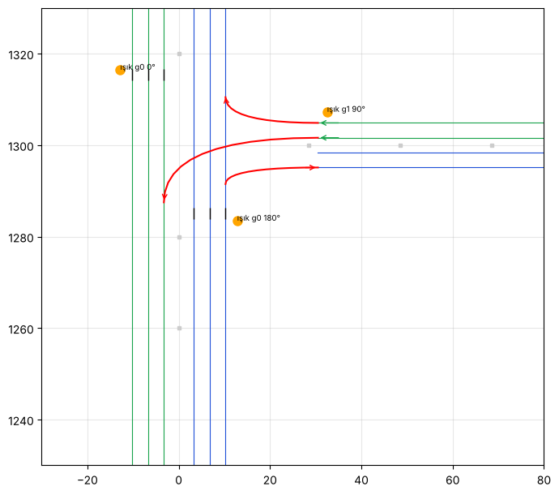

# Trafik

## Araçlar

`tools/blender/arac_kit.py` → `AnkaraBusSimulator/Assets/_Project/Traffic/Vehicles/`. Ortak palet materyali kullanılıyor; her araç 800–2.500 üçgen.

| Model | Boy × En × Yükseklik (m) | Not |
|---|---|---|
| `Taksi_AccentBlue` | 4.37 × 1.70 × 1.46 | Sarı, tavan "TAKSİ" lambası, damalı şerit |
| `Klasik_Sahin_*` (beyaz, kırmızı, lacivert) | 4.24 × 1.64 × 1.40 | Tofaş Şahin, krom tampon |
| `Klasik_Toros_*` (mavi, bej) | 4.35 × 1.64 × 1.44 | Renault 12 Toros |
| `Klasik_Murat131_*` (turuncu, yeşil) | 4.26 × 1.65 × 1.40 | Murat 131 |
| `Klasik_Broadway_*` (gri, kırmızı) | 4.06 × 1.63 × 1.41 | Renault Broadway |
| `Modern_Linea_*` (gri, beyaz) | 4.56 × 1.73 × 1.49 | Fiat Linea |
| `Dolmus_Transit` | 5.50 × 1.98 × 2.40 | Beyaz minibüs, sarı tavan tabelası |

Hiyerarşi otobüsle aynı: kök + `Govde` + `Teker_OnSol/OnSag/ArkaSol/ArkaSag` (pivot tekerlek merkezinde). Ön +Z, sağ +X.

## Kod (`Assets/_Project/Scripts/Traffic/`)

- **`TrafficLane`**: Tek yönlü şerit (nokta dizisi) ve hız sınırı.
- **`TrafficCar`**: Şeridi izleyen kinematik araç. Fizik simülasyonu yok, mobilde ucuz. Önündeki **Rigidbody'si olan** cisme (başka araç ya da otobüs) göre yavaşlar ve durur; yol ve binalar yok sayılır. Tekerlekleri döndürür.
- **`TrafficSpawner`**: Oyuncunun çevresinde sabit sayıda araç tutar (varsayılan 24). Uzaklaşan (> 280 m) ya da şeridin sonuna gelen aracı oyuncudan en az 70 m uzakta boş bir şerit noktasına taşır. `Instantiate/Destroy` yok, araçlar havuzda tutulur. Araç türü ağırlıkla seçilir.

## Hat 1'de kurulum

Harita kurucusu (**Ankara Bus → Hat 1 Haritasını Kur**) `Trafik` objesini otomatik oluşturur:
- 10 şerit: bulvarda 2×3, Cinnah'ta 2×2, her biri gidiş ve dönüş.
- `TrafficSpawner`: `Traffic/Vehicles` içindeki tüm modeller. Ağırlıklar taksiler toplamın **%30**'u, dolmuş **%10**'u, diğerleri **%60**'ı olacak şekilde.

**Yapılması gereken tek şey:** Otobüsün etiketini (Tag) **`Player`** yapmak. Spawner oyuncuyu bu etiketle bulur.

## Kuğulu kavşağı: dönüşler ve trafik ışığı

Kırmızı çizgiler bağlantı şeritleri, siyah çizgiler durma çizgileri, turuncu noktalar trafik ışıkları.

- **Dönüşler** (`TrafficLane.Exit`): Şerit, belli bir mesafede başka bir şeride bağlanır; araç oraya gelince olasılığa göre geçer.
  - Bulvarın en sağ şeridinden Cinnah'a sağa dönüş (%35).
  - Cinnah'tan inenler: iç şeritten Kızılay yönüne sola, dış şeritten bulvarın kuzey koluna sağa.
- **Trafik ışığı** (`TrafficSignal`): İki faz.
  1. Bulvar (iki yön ve sağa dönüş): 20 sn yeşil, 3 sn sarı, 1,5 sn tüm-kırmızı.
  2. Cinnah'tan çıkış: 10 sn yeşil, 3 sn sarı, 1,5 sn tüm-kırmızı.
- **Araçların uyması:** Kırmızıda durma çizgisinde durur. Sarıda yalnızca güvenle durabiliyorsa durur, duramıyorsa geçer.
- **Işık modeli** `Props/Trafik_Lambasi`: Direk, yola uzanan kol ve üç lambalı kafa. `Lamba_Kirmizi`, `Lamba_Sari` ve `Lamba_Yesil` ayrı objeler; yanan açılır, sönükken koyu lens görünür.
- Oyuncunun otobüsü ışığa uymak zorunda değil. Kırmızıda geçme cezası sonraki adım olabilir.

Harita kurucusu ışıkları, bağlantı şeritlerini ve durma çizgilerini `Hat1_Yerlesim.json`'dan kurar. Mevcut sahnede görmek için **Ankara Bus → Hat 1 Haritasını Kur** ile harita yeniden kurulmalı.

## Bilinen sınırlar (MVP)

- Sollama yalnızca duran engelin arkasında yapılır (aşağıda); hareketli yavaş aracı sollama yok.
- Atakule dönüş halkasında trafik yok; Cinnah şeritleri halka girişinde biter.

## Sollama, korna ve dolmuş (`TrafficCar`)

- **Yana kayma:** Araç şerit çizgisinden yana kayabilir (`lateral`, + sağ). Kayarken burnu kayma yönüne döner. Dönüşler yalnızca araç şeridin ortasındayken alınır.
- **Sollama:** Duran bir engelin (ör. şeritte duran otobüs, bozulmuş gibi duran araç) arkasında 2,5 sn bekleyen araç, aynı yönde 2,5–4,5 m yandaki şeride geçmeyi dener:
  - Şerit 12 m geride ve 14 m ileride boş olmalı; otobüs de orada olmamalı.
  - Arama en çok saniyede bir yapılır.
  - Işığa 80 m ve yaya geçidine 30 m kala sollama yapılmaz, kuyrukta şerit değiştirilmez.
- **Korna:** Otobüs önünü kapatınca 4 sn sonra korna çalar. 4–8 sn arayla en çok 3 kez; üç farklı korna sesi var (oyunda üretilir, 3B ses).
- **Dolmuş:** Adında "Dolmus" geçen araçlar, şeridinin 1,5–5 m sağındaki aynı yöne bakan durağa yanaşır:
  - Durak 25–70 m önündeyken karar verir. Otobüs durağın 28 m içindeyse ya da orada başka dolmuş varsa yanaşmaz.
  - Cebin başında yana kayar ve 4–9 sn bekler, sonra yola döner.
  - Aynı durağa en erken 20 sn sonra yeniden bakar.

## Yayalar (`YayaGecitleri`)

Sahneye eklenmez: rota ve şerit olan her sahnede kendiliğinden kurulur.
- **Geçit:** Her durağın 26 m ilerisine bütün yolu kesen zebra çizgisi çizilir (palet `serit_beyaz`, yalnızca şerit olan yerlerde, refüjde yok). Dik şerit yakınsa (kavşak) ya da şerit bitiyorsa geçit konmaz.
- **Yayalar:**
  - Otobüs 170 m içindeyken 7–20 sn'de bir 1–2 yaya, yolcu havuzundan (`PassengerManager`) çıkar.
  - Geçide 30 m içinde 4 m/sn'den hızlı yaklaşan araç ya da otobüs yoksa karşıya yürür, karşıda 4–8 m yürüyüp kaybolur.
- **Araçlar:** Geçit doluyken (yolda yaya varken) trafik araçları önünde durur (`TrafficLane.IGecit`, durma çizgisi gibi).
- **Otobüs cezaları:**
  - Yayaya çarpmak: −150. Yaya düşer, 4 sn yerde kalır. Fizik yok; yayanın otobüs gövde kutusunun içine girmesine bakılır.
  - Üzerinde (otobüsün 7 m yakınında) yaya varken geçidi geçmek: "yol vermedin", −40.
  - İkisi de yıldızdan 1 düşürür ve hat sonu özetinde "Yaya ihlali" olarak görünür.
