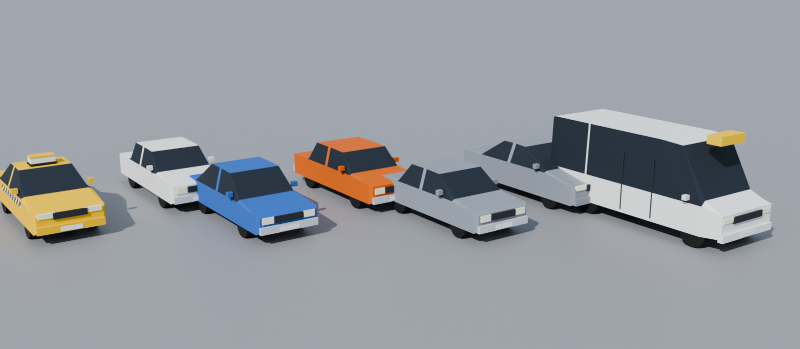

# Trafik

## Araçlar

`tools/blender/arac_kit.py` → `AnkaraBusSimulator/Assets/_Project/Traffic/Vehicles/`. Ortak palet materyali kullanılıyor; her araç 800–2.500 üçgen.

| Model | Boy × En × Yükseklik (m) | Not |
|---|---|---|
| `Taksi_AccentBlue` | 4.37 × 1.70 × 1.46 | Sarı, tavan "TAKSİ" lambası, damalı şerit |
| `Klasik_Sahin_*` (beyaz, kırmızı, lacivert) | 4.24 × 1.64 × 1.40 | Tofaş Şahin, krom tampon |
| `Klasik_Toros_*` (mavi, bej) | 4.35 × 1.64 × 1.44 | Renault 12 Toros |
| `Klasik_Murat131_*` (turuncu, yeşil) | 4.26 × 1.65 × 1.40 | Murat 131 |
| `Klasik_Broadway_*` (gri, kırmızı) | 4.06 × 1.63 × 1.41 | Renault Broadway |
| `Modern_Linea_*` (gri, beyaz) | 4.56 × 1.73 × 1.49 | Fiat Linea |
| `Dolmus_Transit` | 5.50 × 1.98 × 2.40 | Beyaz minibüs, sarı tavan tabelası |

Hiyerarşi otobüsle aynı: kök + `Govde` + `Teker_OnSol/OnSag/ArkaSol/ArkaSag` (pivot tekerlek merkezinde). Ön +Z, sağ +X.

## Kod (`Assets/_Project/Scripts/Traffic/`)

- **`TrafficLane`**: Tek yönlü şerit (nokta dizisi) ve hız sınırı.
- **`TrafficCar`**: Şeridi izleyen kinematik araç. Fizik simülasyonu yok, mobilde ucuz. Önündeki **Rigidbody'si olan** cisme (başka araç ya da otobüs) göre yavaşlar ve durur; yol ve binalar yok sayılır. Tekerlekleri döndürür.
- **`TrafficSpawner`**: Oyuncunun çevresinde sabit sayıda araç tutar (varsayılan 24). Uzaklaşan (> 280 m) ya da şeridin sonuna gelen aracı oyuncudan en az 70 m uzakta boş bir şerit noktasına taşır. `Instantiate/Destroy` yok, araçlar havuzda tutulur. Araç türü ağırlıkla seçilir.

## Hat 1'de kurulum

Harita kurucusu (**Ankara Bus → Hat 1 Haritasını Kur**) `Trafik` objesini otomatik oluşturur:
- 10 şerit: bulvarda 2×3, Cinnah'ta 2×2, her biri gidiş ve dönüş.
- `TrafficSpawner`: `Traffic/Vehicles` içindeki tüm modeller. Ağırlıklar taksiler toplamın **%30**'u, dolmuş **%10**'u, diğerleri **%60**'ı olacak şekilde.

**Yapılması gereken tek şey:** Otobüsün etiketini (Tag) **`Player`** yapmak. Spawner oyuncuyu bu etiketle bulur.

## Bilinen sınırlar (MVP)

- Kavşakta dönüş yok. Bulvardaki araçlar Cinnah'a girmez; şerit sonuna gelen araç başka yere taşınır.
- Şerit değiştirme ve sollama yok. Durak cebinde duran otobüsün arkasındaki araç, otobüs kalkana kadar bekler.
- Trafik ışıkları yok.
