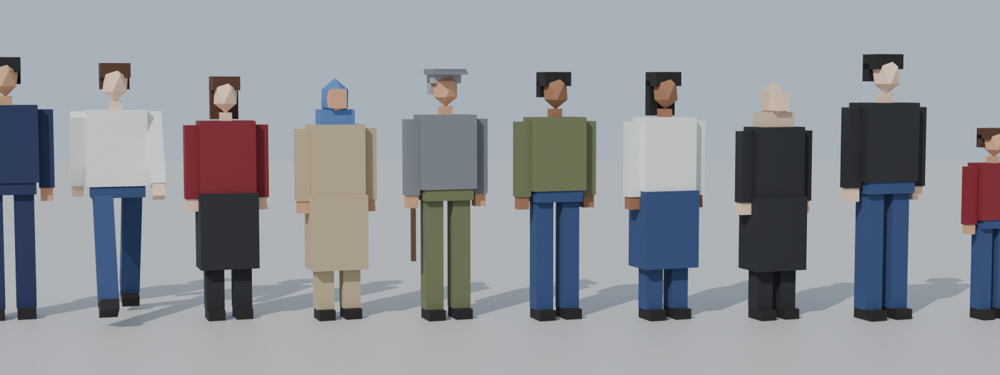

# Yolcular

## Modeller

`tools/blender/yolcu_kit.py` → `AnkaraBusSimulator/Assets/_Project/Passengers/Models/`. 10 çeşit: takım elbiseli, kotlu, kadın, başörtülü, kasketli ve bastonlu yaşlı, sırt çantalı öğrenci, montlu, çocuk. Her biri ~200 üçgen, ortak palet materyali, gölge vermez.

Hiyerarşi: kök + `Govde` + `Bacak_Sol/Sag` (pivot kalçada) + `Kol_Sol/Sag` (pivot omuzda). İskelet yok; yürüme, bu parçaların kodla sallanmasıyla yapılır.

## Kod (`Assets/_Project/Scripts/Passengers/`)

- **`Passenger`:** Hedefe yürür (1,3 m/s), kol ve bacaklarını sallar, bekleyince yola döner.
- **`PassengerManager`** (sahnede bir tane): Tüm `BusStop`'larda bekleyen yolcuları yönetir.
  - Otobüs bir durağa 160 m yaklaşınca 2–8 yolcuyu kaldırımda oluşturur, uzaklaşınca kaldırır. Havuzlama var; `Instantiate/Destroy` sürekli çalışmaz.
  - Kaldırımı kendisi bulur: duraktan sağa doğru bordür yükselmesini ışınla arar.
  - Oyuncunun otobüsüne `BusPassengers` yoksa ekler.
- **`BusPassengers`** (otobüste): Sıradaki durakta otobüs durup kapıları açınca iniş-biniş başlar.
  1. **İniş:** Önce inenler **arka kapılardan** iner. Sayısı rastgeledir; son durakta herkes iner.
  2. **Biniş:** Sonra bekleyenler **ön kapıdan** biner. Ön kapı kapalıysa ya da son duraktaysa (hat sonu) kimse binmez.
  3. **Durak tamamlanması:** İniş-biniş sürerken (`IsBusy`) `RouteTracker` durağı tamamlamaz; bitince her zamanki bekleme süresi işler.
  4. **Doluluk:** Kapasite `BusDefinition.passengerCapacity` (90). Yolcu sayısı `Onboard`, değişince `OnboardChanged` olayı.
- **`BusHud`:** İsteğe bağlı `passengerText` alanı "Yolcu 24/90" gösterir. Dokunmatik arayüze (`BusTouchControls`) eklemek için `BusPassengers.Onboard` okunabilir.
- **`BusDoorController`:** Yeni `IsDoorOpen(i)` ve `DoorCenter(i)` (yolcuların yürüdüğü kapı noktası).

## Sahneye ekleme

Harita kurucusu (**Ankara Bus → Hat 1 Haritasını Kur**) artık `Yolcular` objesini de kurar. Mevcut Hat 1 sahnesinde haritayı yeniden kurmak istemezsen elle eklenebilir:
1. Boş bir obje oluştur, `PassengerManager` ekle.
2. `Models` dizisine `Passengers/Models` içindeki 10 FBX'i, `Palette Material`'a `Materials/M_AnkaraPalet`'i koy.

## Bilinen sınırlar

- Yolcular otobüsün içinde görünmez (binince kaybolur).
- Bilet, para ve memnuniyet sistemi yok; sonraki adım olabilir.
- Kaldırımda birbirlerinin içinden geçebilirler (çarpışma yok).
